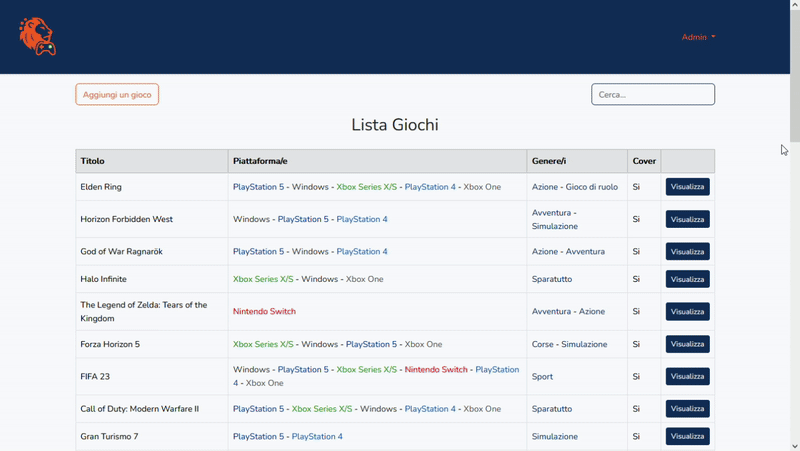

# 🎮 Gamelion - WebApp con Laravel & Bootstrap

Applicazione web sviluppata con **Laravel** per la gestione e visualizzazione di videogiochi.  
Include interfaccia responsive, navigazione tra categorie, filtri e dettagli gioco.

## 🖥️ Tecnologie utilizzate

**Backend [laravel-gamelion](https://github.com/giovannidibello/laravel-gamelion):**

- PHP 8+
- Laravel 10+
- Blade (motore di templating Laravel)
- Laravel Eloquent ORM
- Bootstrap 5
- Font Awesome
- MySQL
- Faker (per seed dati fittizi)

L'applicazione rappresenta il pannello di amministrazione per la gestione dei giochi, sviluppata interamente con Laravel e Blade

## 📸 Preview

  
> Demo animata dell’interfaccia di amministrazione di Gamelion.

## 📁 Struttura del Progetto

laravel-gamelion/
├── app/ # Controllers, Models
├── bootstrap/
├── config/
├── database/
│ ├── factories/
│ ├── migrations/
│ └── seeders/
├── public/ # Assets pubblici (img, CSS, JS)
├── resources/
│ ├── views/ # Blade views (layouts, pages, partials)
│ └── sass/ # File SCSS (se presenti)
├── routes/
│ └── web.php # Rotte principali dell’app
├── .env.example
├── composer.json
└── README.md


## 🚀 Avvio del progetto

1. Clona la repository:

```bash
git clone https://github.com/giovannidibello/laravel-gamelion.git
cd laravel-gamelion

composer install

cp .env.example .env
# Modifica le credenziali DB nel file .env
php artisan key:generate

php artisan migrate --seed

php artisan serve

Apri nel browser: http://127.0.0.1:8000

## 🎯 Funzionalità

- ✅ **Elenco giochi** con immagini, titoli e generi
- ✅ **Filtri** per categoria e disponibilità
- ✅ **Ricerca testuale** dinamica
- ✅ **Pagine di dettaglio** per ogni gioco
- ✅ **Layout responsive** con Bootstrap
- ✅ **Seed automatici** con Faker per testing veloce
- ✅ Struttura **RESTful** con routing Laravel
- ✅ Utilizzo di **Controller, Model e View** secondo il pattern MVC

## 🧠 Obiettivi didattici

- 📌 Comprendere l’architettura **MVC** con Laravel
- 📌 Utilizzare **Blade** per creare layout e componenti riutilizzabili
- 📌 Eseguire **migrazioni**, **seed** e **query Eloquent**
- 📌 Integrare **Bootstrap** per il design responsive
- 📌 Gestire **routing, controller e viste** in modo modulare
- 📌 Progettare un’app **CRUD** partendo da zero

## 👨‍💻 Autore

- **Giovanni Di Bello**  
- [GitHub](https://github.com/giovannidibello)
